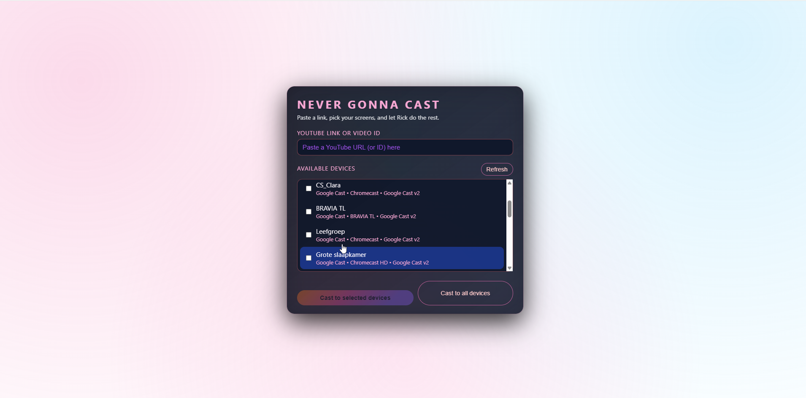

# QuickCast – Never Gonna Cast

QuickCast is a tiny Node.js tool with a neon, Rick Astley–inspired UI that lets you **cast a single YouTube video** to:



- **DIAL / SSDP devices** (via `peer-dial`)
- **Google Cast v2 devices** (Chromecast, Cast‑enabled TVs, speakers) via `castv2-client` + mDNS

## Prerequisites

- Node.js 18+ installed
- Your PC and the target devices on the **same network**
- One or more devices that support **YouTube casting** via DIAL or Google Cast v2

## Install & run

From the `c:\CAST` folder:

```bash
cd c:\CAST
npm install
npm start
```

Then open:

```text
http://localhost:3001
```

in your browser.

## Using the app

1. **Paste a YouTube link or video ID** into the input field.
2. Wait a moment for devices to appear, or click **Refresh** to rescan.
3. **Select one or more devices** using the checkboxes.
4. Click **“Cast to selected devices”** or **“Cast to all devices”**.

If the devices support YouTube casting, playback should start on those targets shortly.

## Notes & limitations

- Discovery is **best-effort** and depends on your network, firewall, and device firmware.
- Only **YouTube** is supported:
  - For DIAL devices via the `"YouTube"` app and payload `v=VIDEO_ID`
  - For Cast v2 devices via the official **YouTube receiver app** (`APP_ID = 233637DE`)
- Some devices may appear in Chrome’s Cast dialog but not here, or vice versa, depending on their DIAL / Cast support and how they advertise themselves on the network.

